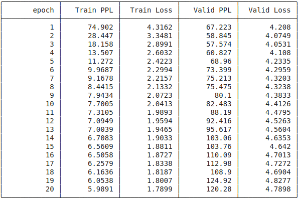
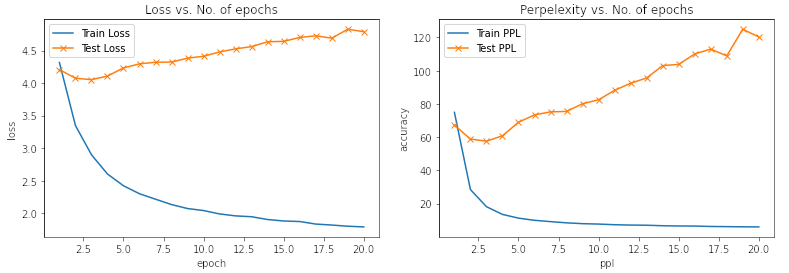
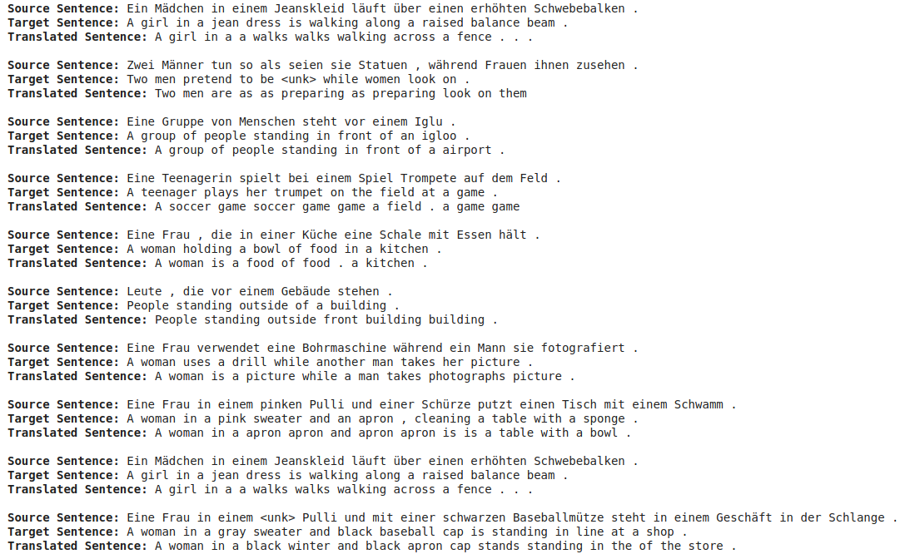
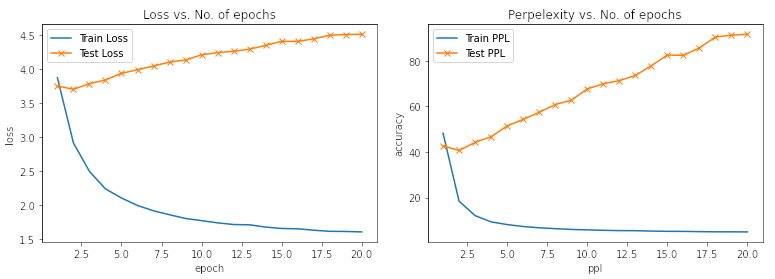

# E2A8

## Tasks Done
- [x] Notebook 2 - Learning Phrase Representations using RNN Encoder-Decoder for Statistical Machine Translation
- [x] Notebook 3 - Neural Machine Translation by Jointly Learning to Align and Translate
- [x] Notebook 4 - Packed Padded Sequences, Masking, Inference and BLEU **(OPTIONAL)**


## Assignment Requirements
All notebooks:
- [x] use none of the legacy stuff
- [x] use Multi30k dataset from torchtext
- [x] uses yield_token, and other code that was presented in lecture

## Notebook 2

### Training Log


### Plot of Loss/Perplexity vs. Epoch


### Sample Prediction


## (Optional) Notebook 4

### Changes Made
The code is almost the same except for one major change: In the Encoder Module, we are using `nn.utils.rnn.pack_padded_sequence` which needs the length of the source sequence (in addition to the sequence itself). This has been done by adding the following line inside the `collate_fn(batch)` function. 

```python
src_lengths = torch.LongTensor([len(x) for x in src_batch])
```

Also, some additional lines (related to converting to and fro between index and sentences/words) were added in the `translate_sentence` and `calculate_bleu` functions.

### Training Log


### Plot of Loss/Perplexity vs. Epoch


### Sample Prediction


### Attention


### BLUE Scores
After training, a BLEU score of **26.75** was acheived.
