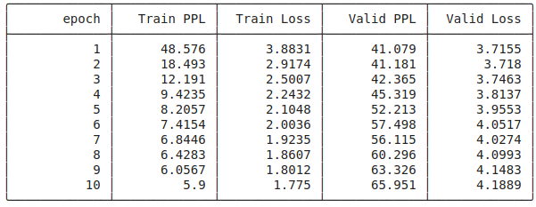
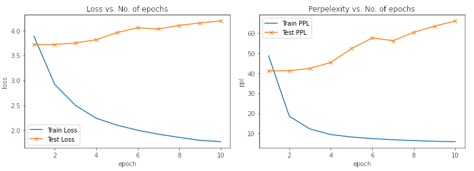
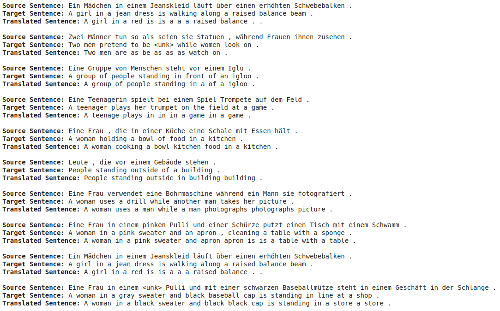

# E2A8

## Tasks Done
- [x] Notebook 2 - Learning Phrase Representations using RNN Encoder-Decoder for Statistical Machine Translation
- [x] Notebook 3 - Neural Machine Translation by Jointly Learning to Align and Translate
- [x] Notebook 4 - Packed Padded Sequences, Masking, Inference and BLEU **(OPTIONAL)**


## Assignment Requirements
All notebooks:
- [x] use none of the legacy stuff
- [x] use Multi30k dataset from torchtext
- [x] uses yield_token, and other code that was presented in lecture

## Notebook 2

### Objectives
This uses a standard Encoder-Decoder network as a Sequence-to-Sequence Model. The output (actually, the hidden state) contains the gist of information as captured by the RNN layer of the Encoder (implemented via GRU). This state is passed on to the Decoder as its initial hidden state.

### Training Log


### Plot of Loss/Perplexity vs. Epoch


### Sample Prediction


## Notebook 3

This model uses bidirectional GRU; the 'forward GRU' captures information while processing the sequence from left-to-right and the 'backward GRU' captures information while processing the sequence from right-to-left

In addition, it uses attention to capture the 
### Objectives


### Training Log


### Plot of Loss/Perplexity vs. Epoch


### Sample Prediction



## (Optional) Notebook 4

### Objectives


### Changes Made
The code is almost the same except for one major change: In the Encoder Module, we are using `nn.utils.rnn.pack_padded_sequence` which needs the length of the source sequence (in addition to the sequence itself). This has been done by adding the following line inside the `collate_fn(batch)` function. 

```python
src_lengths = torch.LongTensor([len(x) for x in src_batch])
```

Also, some additional lines (related to converting to and fro between index and sentences/words) were added in the `translate_sentence` and `calculate_bleu` functions.

### Training Log


### Plot of Loss/Perplexity vs. Epoch


### Sample Prediction


### Attention


### BLUE Scores
After training, a BLEU score of **26.75** was acheived.
