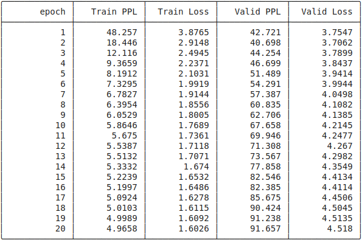
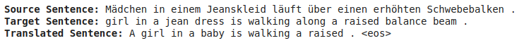
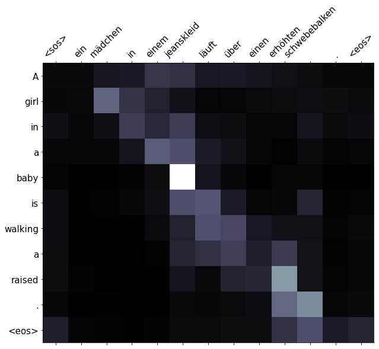

# E2A8

## Tasks Done
- [x] Notebook 2
- [x] Notebook 3
- [x] Notebook 4

## Notebook 2

## (Optional) Notebook 4
The code is almost the same except for one major change: In the Encoder Module, we are using `nn.utils.rnn.pack_padded_sequence` which needs the length of the source sequence (in addition to the sequence itself). This has been done by adding the following line inside the `collate_fn(batch)` function. 

```python
src_lengths = torch.LongTensor([len(x) for x in src_batch])
```

### Training Log


### Sample Prediction


### Attention


### BLUE Scores
After training, a BLEU score of **26.75** was acheived.
